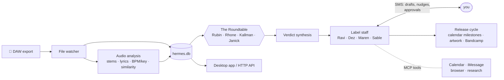

# Hermes — an AI record label that runs itself

A multi-agent system that operates a working record label for an independent artist: A&R, release management, sync licensing, creative direction, artwork, and artist communication — all run by autonomous agents coordinating over a shared database, reachable by SMS.

Built from first-principles study of how 19 labels (Motown through Brainfeeder) and artists like Quincy Jones, Prince, and D'Angelo actually operated — encoded into agent behaviors.

> **Status:** live for one artist. 311 portable tests pass; Mac deployment checks are
> environment-specific. Full release-cycle automation is still in progress. See
> [AUDIT.md](AUDIT.md) and [NEXT.md](NEXT.md).

## The label staff — and who runs on what

**One `OPENROUTER_API_KEY` powers everything.** Every model call — staff, roundtable, audio analysis, artwork review — routes through OpenRouter. See the live mapping anytime with `uv run python scripts/model_rundown.py` (also printed at every launch).

| Agent | Role | Model |
|---|---|---|
| **Ravi Kendrick** | A&R — hears every export, decides what moves forward | Claude Opus 4.6 |
| **Dez Montoya** | Artist manager — release cycles, deadlines, SMS nudges | Claude Sonnet 4.6 |
| **Maren Lusk** | Creative director — artwork direction and review | Claude Opus 4.6 |
| **Sable Chen** | Release ops — Bandcamp management, upload preflight | Claude Sonnet 4.6 |
| **Intake** | Receives new music, routes it into the system | Claude Sonnet 4.6 |

And before anything ships, every track faces **the Roundtable** — four agents modeled on real label legends, each with a veto lens:

| Judge | Lens | Model |
|---|---|---|
| **Rick Rubin** | Creative catalyst — does it serve the song? | Claude Opus 4.6 |
| **Sylvia Rhone** | Cultural authenticator — is it true? | Claude Sonnet 4.6 |
| **Craig Kallman** | Early conviction scout — would I sign this today? | Claude Sonnet 4.6 |
| **John Janick** | Vision gatekeeper — does it fit the arc? | Claude Sonnet 4.6 |

The pipeline underneath: audio analysis on Gemini 3.1 Pro, lyrics/artwork review on Gemini 3.5 Flash, verdict synthesis on Claude Sonnet 4.5, SMS intent parsing on Claude Sonnet 5 — all via the same one key, all swappable (`OPENROUTER_AGENT_MODEL`, `OPENROUTER_AUDIO_MODEL`, or per-agent in `agents/<name>/tools.yaml`).

Every outbound email or upload goes through draft → artist approval → send. Agents never publish on their own.

## What it does

- **Listens to your exports** — a file watcher catches every bounce from your DAW, fingerprints it, registers it in the catalog, and drops a session event on your Google Calendar
- **Hears the music** — audio analysis pipeline: stem separation (Demucs), transcription (faster-whisper), BPM/key/loudness (librosa, pyloudnorm), version similarity scoring
- **Runs release cycles** — T-4 weeks through release day, with milestones as real calendar events and SMS nudges
- **Convenes a listening panel** — sends candidate tracks to trusted humans over iMessage, collects and catalogs verdicts
- **Works on a schedule** — 13 cron jobs drive daily agent routines ([AGENT_SCHEDULE.md](AGENT_SCHEDULE.md))
- **Talks to the world through MCP** — Google Calendar, iMessage, browser automation, and research tools are wired into agent profiles as tools; the system itself is also exposed as an MCP server (`mcp_server.py`) and an HTTP API (`http_api.py`)
- **Has a face** — a Tauri desktop app for catalog, sessions, and release dashboards

## How it flows



Nothing ships without you: agents draft, you approve by text, then they execute.

- **Python 3.12**, dependency management via [uv](https://docs.astral.sh/uv/)
- **SQLite** as the single source of truth (Litestream replication supported)
- **Backblaze B2** for audio storage (audio never lives in git)
- Deployable to **Render** (`render.yaml`) or run entirely local

## Quickstart

One key. That's the whole setup:

```bash
git clone <this-repo> && cd ai-record-label
uv sync
cp .env.example .env   # add your OPENROUTER_API_KEY — https://openrouter.ai/keys
./scripts/launch.sh    # prints the model rundown, starts services + desktop app
```

On Windows PowerShell, use the equivalent launcher (it also builds the web UI and
applies every pending database migration):

```powershell
.\scripts\launch.ps1
# Later: .\scripts\launch.ps1 -Stop
```

Requires: Python 3.12+ and an [OpenRouter](https://openrouter.ai/keys) API key — that single key powers every agent and pipeline stage. Everything else in `.env` is optional and unlocks one feature each (Twilio → SMS with your label staff, B2 → cloud audio vault, Google OAuth → calendar sync). The analysis pipeline and desktop app run without any of them.

Run the tests:

```bash
./scripts/run_tests.sh
```

## Docs

- [FEATURES.md](FEATURES.md) — the full feature map and the label-history research behind it
- [AGENT_SCHEDULE.md](AGENT_SCHEDULE.md) — what each agent does and when
- [OPERATIONS.md](OPERATIONS.md) — running it day to day
- [STEM_SEPARATION.md](STEM_SEPARATION.md) — the audio pipeline in depth

## Why

I'm a producer ([Young Denzel](https://just-inn-case.bandcamp.com/)) and an applied AI engineer. Independent artists do the work of an entire label staff alone, badly, at 1am. I studied how the great labels actually operated and hired agents to do those jobs instead.

## License

[MIT](LICENSE)
